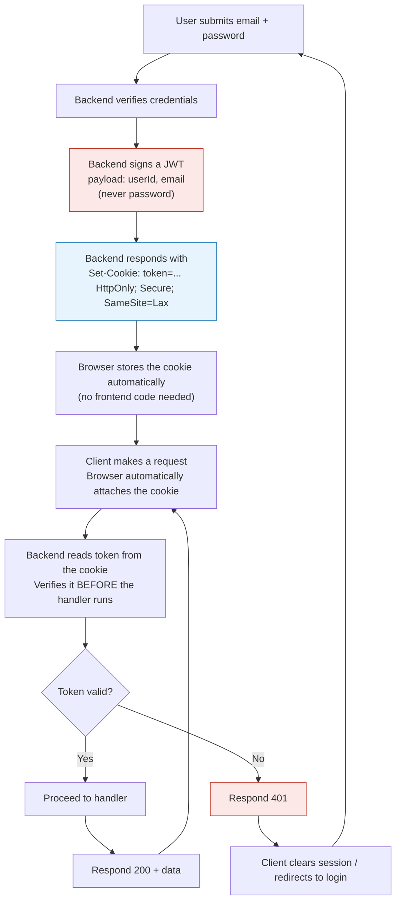

# Authentication Data Flow

## Notes on this flow

- **Token payload**: `userId`, `name`, `email` — never `password`. A JWT is signed,
  not encrypted, so anything in the payload is readable by whoever holds the
  token (including the user themselves, via DevTools).
- **Verification happens before every handler runs** — this is the "per
  request, before processing" rule: no protected route logic executes until
  the token passes verification.
- **On invalid/missing token**, the server doesn't try to "fix" or refresh
  anything itself — it responds `401`, and the *client* is responsible for
  reacting to that by sending the user back to login.